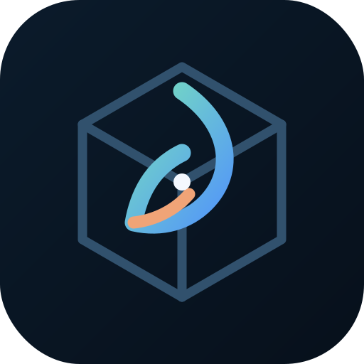
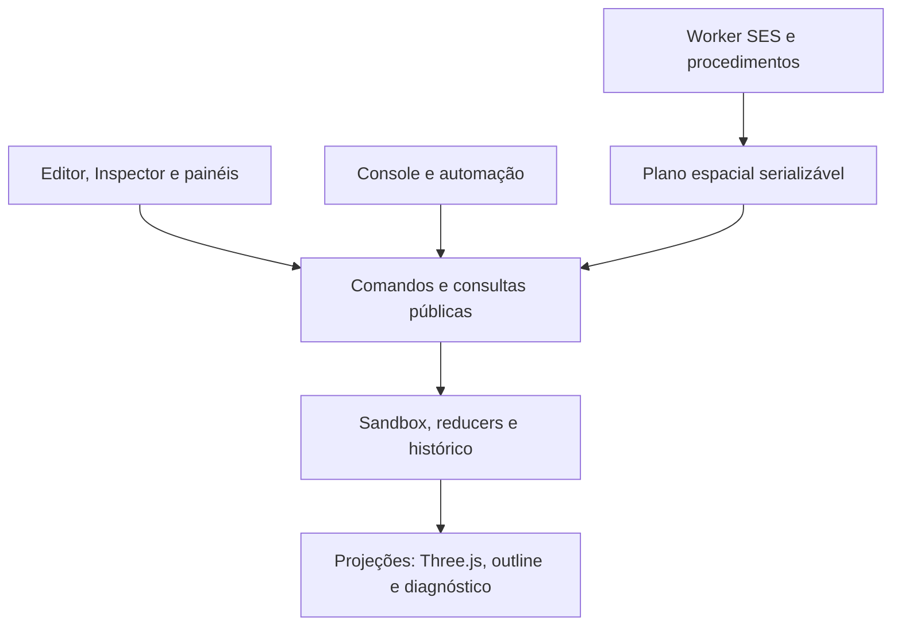

# SpatialSeed



**Um ambiente espacial, procedural e orientado a comandos para criar, editar, programar, salvar e habitar mundos digitais.**

[Experimentar no GitHub Pages](https://livredopodervil.github.io/SpatialSeed/apps/web/) · [Documentação técnica](docs/) · [Decisões do projeto](docs/project/DECISIONS.md)

> **Estado:** protótipo experimental em desenvolvimento ativo. A versão pública acompanha o branch `main`; branches `feature/*` podem conter capacidades mais recentes ainda em validação.

## O que é

SpatialSeed começou como um editor WebGL para dispositivos móveis, mas seu objetivo é mais amplo que o de um editor 3D convencional. O projeto investiga como um mundo digital pode conservar identidade, memória e regras próprias enquanto é operado por interfaces diferentes: botões, gizmos, inspetores, console, programas, automações e, futuramente, agentes e simuladores.

A cena manual e a produção procedural não são sistemas paralelos. Ambas usam a mesma camada pública de comandos. Uma cor aplicada no Inspector, uma transformação feita pelo gizmo e uma série criada no console percorrem os mesmos contratos de domínio, histórico e validação.

O resultado atual combina:

- editor 3D responsivo para toque, mouse e teclado;
- linguagem afim para repetições e construções paramétricas;
- runtime JavaScript isolado para cálculos, funções e procedimentos;
- hierarquia de grupos aninháveis com transformações locais;
- propriedades, materiais, texturas e cores de instância editáveis em lote;
- aplicação web instalável, utilizável offline depois do primeiro carregamento;
- testes, diagnósticos, auditoria de recursos e benchmarks executáveis no próprio aplicativo.

## Por que existe

Em muitos sistemas, cada interface reimplementa parte da lógica: o botão faz uma coisa, o console faz outra e a automação conhece apenas uma fração do editor. SpatialSeed adota a direção oposta:

1. uma operação espacial é definida uma única vez como comando;
2. interfaces apenas traduzem intenção para esse comando;
3. o sandbox valida e registra a mudança de forma atômica;
4. renderizadores projetam o estado, mas não são donos dele;
5. programas produzem planos revisáveis antes de alterar a cena.

Isso permite que edição manual, geração procedural, testes e futuras interfaces compartilhem comportamento sem duplicar a lógica do mundo.

## Experimente agora

A aplicação pública está em:

**https://livredopodervil.github.io/SpatialSeed/apps/web/**

No menu **Projeto**, use **Como instalar** para adicionar o PWA ao aparelho. O primeiro acesso precisa de rede; depois que o service worker instalar os recursos, o aplicativo pode abrir offline.

O build efetivamente carregado aparece no rodapé. Se a publicação e o cache controlador forem diferentes, feche todas as janelas do aplicativo e abra-o novamente.

## Execução local

O projeto usa módulos ES nativos e dependências vendorizadas. Não há etapa obrigatória de compilação nem `npm install`.

### Ambiente genérico

```bash
git clone https://github.com/livredopodervil/SpatialSeed.git
cd SpatialSeed
python3 -m http.server 8082 --bind 127.0.0.1
```

Abra:

```text
http://127.0.0.1:8082/apps/web/
```

### Android com Termux

O servidor de desenvolvimento sem cache foi preparado para o diretório `~/SpatialSeed-monorepo`:

```bash
git clone https://github.com/livredopodervil/SpatialSeed.git ~/SpatialSeed-monorepo
cd ~/SpatialSeed-monorepo
python tools/no_cache_server.py
```

Em outra sessão do Termux:

```bash
termux-open-url 'http://127.0.0.1:8082/apps/web/'
```

Também está disponível o utilitário operacional:

```bash
bash tools/seedctl help
bash tools/seedctl serve
```

Um servidor HTTP é necessário porque módulos ES, import maps e service workers dependem das regras de uma origem web. Para PWA fora de `127.0.0.1` ou `localhost`, use HTTPS.

## Primeiro percurso pela interface

| Objetivo | Superfície |
| --- | --- |
| Criar caixas, esferas, cilindros/cones, planos e polígonos | **Criar** |
| Navegar, selecionar, mover, girar e escalar | barra principal e gizmo |
| Escolher seleção única/múltipla e operações de inclusão/remoção | **Seleção** |
| Alterar pivô, snapping e visualização do gizmo | **Transformar** |
| Agrupar, desagrupar, desfazer e refazer | **Editar** |
| Editar nome, transformações, cor, textura e propriedades em lote | **Inspector** |
| Ver árvore regional, diagnóstico, recursos e console | **Painéis** |
| Salvar, abrir, instalar e trocar catálogos de procedimentos | **Projeto** |

Os painéis são móveis e redimensionáveis. Sua disposição, o layout da barra e preferências de apresentação ficam no armazenamento local do navegador. A composição inicial é declarada em [`apps/web/config/ui.default.json`](apps/web/config/ui.default.json), sem duplicar operações do domínio.

## Capacidades atuais

### Edição e seleção

- seleção única, múltipla, alternada e por área;
- operações explícitas de substituir, incluir, remover e alternar membros;
- transformações em espaço mundial ou local;
- pivôs por mediana, limites, objeto ativo ou posição personalizada;
- snapping de translação, rotação, escala e grade;
- preview visual separado do commit da transformação;
- undo e redo locais sobre comandos confirmados.

### Hierarquia

- grupos lógicos com âncora e transform local;
- grupos potencialmente aninháveis;
- transformação, duplicação e exclusão de subárvores completas;
- desagrupamento de um nível sem deslocamento no espaço mundial;
- caixa de seleção, highlight e gizmo projetados para a unidade lógica;
- preservação das relações internas quando o pivô ou o grupo se move.

### Geometrias e aparência

- caixa, esfera, cilindro/cone, plano e polígono regular;
- criação em planos `XY`, `XZ` e `YZ`, por normal/tangente ou por três pontos;
- descritores paramétricos fornecidos pelo `GeometryRegistry`;
- cor hexadecimal arbitrária, opacidade e transparência;
- textura com repetição, deslocamento, rotação e modo de wrapping;
- cor por instância sem separar desnecessariamente o lote de renderização;
- superfícies abertas renderizadas pelos dois lados;
- recursos de geometria, material e textura compartilhados e contados por referência.

### Produção afim

O console pode criar até 100.000 objetos em uma série atômica. As expressões conhecem o índice `i`, o parâmetro normalizado `u`, a quantidade `count`, constantes e funções matemáticas.

Exemplo: quarenta esferas distribuídas em um círculo.

```text
create sphere radius 0.3 count 40 move "4*cos(i*pi/20)" 0 "4*sin(i*pi/20)"
```

Exemplo: vinte caixas submetidas a translação e rotação paramétricas.

```text
create box size 1 1 1 count 20 move 1 0 0 rotate 0 9 0
```

Esses comandos chamam diretamente a mesma operação `object.create.geometrySeries` usada pelo painel **Criar**.

## Console e linguagem

O console reúne comandos editoriais, consultas, testes, benchmarks e um runtime de programas. Use `help`, `help create` e `procedure help` para obter a ajuda gerada pela própria versão carregada.

### Comandos editoriais

```text
create polygon 6 radius 2 plane xz origin 0 0 0 color #33aaff
move 2 0 0
rotate 0 30 0
scale 1 2 1
duplicate
repeat
group Estrutura
ungroup
delete
undo
redo
```

### Propriedades compartilhadas

O Inspector e o console consultam o mesmo `PropertyRegistry`:

```text
property list
property inspect
property set appearance.color #33aaff
property set texture.repeat 4 2
property set texture.rotationDeg 15
property set instance.color #ff8a3d
property unset instance.color
```

Uma edição sobre vários objetos é validada por inteiro e gera uma única entrada de histórico. Valores mistos permanecem identificáveis; campos não tocados não são sobrescritos.

### Calculadora e sessão persistente

`calc` avalia expressões JavaScript. `program` aceita funções, objetos, estruturas de controle e `return`. Somente valores colocados em `session` persistem entre execuções.

```text
calc sqrt(3 ** 2 + 4 ** 2)
calc session.radius = 12
program session.area = r => pi * r ** 2
calc session.area(session.radius)
session status
```

O namespace de sessão pertence a um Worker isolado. `session reset` encerra esse estado de cálculo sem alterar a cena.

### Programas espaciais e commit atômico

Programas não recebem acesso direto ao sandbox, renderer, DOM, rede ou sistema de arquivos. Eles recebem apenas capacidades explícitas e podem produzir intenções com `spatial.create`.

Execute primeiro:

```text
program
const count = 24;
for (let i = 0; i < count; i += 1) {
  const angle = i * tau / count;
  spatial.create("sphere", {
    radius: 0.25,
    position: [4 * cos(angle), 0.5, 4 * sin(angle)],
    color: i % 2 ? "#4f8ef7" : "#ef8354"
  });
}
return { count };
```

O programa termina sem tocar a cena. Revise e confirme em uma segunda execução:

```text
plan status
plan commit
```

O commit valida versão, orçamento, geometrias, posições e aparências; simula o comando no reducer; e só então publica todos os objetos em uma transação com um único item de undo. `plan discard` abandona o plano sem efeito.

### Procedimentos e catálogos

Procedimentos são funções nomeadas cujo código-fonte fica separado do projeto espacial.

```text
procedure define tower ({height=8,color="#4488ff"}={}) => spatial.create("box", {
  size:[2,height,2], position:[0,height/2,0], color
})
```

Depois execute, revise e confirme:

```text
procedure run tower {"height":12,"color":"#d48676"}
plan status
plan commit
```

O menu **Projeto** importa e exporta catálogos JSON editáveis em outros editores. O **Editor de procedimentos** permite manter fontes nomeadas com numeração de linhas, quebra visual e realce léxico. Importar uma biblioteca nunca executa seu código; a avaliação só ocorre quando o usuário chama `procedure run`.

## Arquitetura



### Princípios preservados

- **Uma fonte de verdade para operações:** GUI, console e programas convergem na camada de comandos.
- **Lógica separada da visualização:** o renderer projeta estado e previews, mas não define regras editoriais.
- **Atomicidade:** operações em lote são normalizadas antes da mutação e entram juntas no histórico.
- **Capacidades mínimas:** programas só conhecem APIs explicitamente concedidas.
- **Determinismo:** expressões, geradores aleatórios com semente e planos serializáveis favorecem reprodução e teste.
- **Extensão por registros:** famílias geométricas e propriedades entram por descritores, sem condicionais espalhadas pela interface.
- **Mundo e sandbox distintos:** a edição acontece localmente; a arquitetura reserva uma fronteira para revisão, autoridade e publicação regional.

### Pacotes principais

| Pacote | Responsabilidade |
| --- | --- |
| `packages/core` | região, sandbox e eventos |
| `packages/runtime-api` | fachada pública de comandos, consultas, eventos e capacidades |
| `packages/editor-commands` | registro canônico das operações editoriais |
| `packages/region-box` | reducer puro e modelo de estado da região atual |
| `packages/scene-hierarchy` | grupos, parentesco, transforms locais e ciclo de subárvores |
| `packages/geometry-registry` | famílias paramétricas e providers de geometria |
| `packages/property-registry` | propriedades tipadas, inspeção e edição atômica em lote |
| `packages/script-runtime` | Workers, SES, sessões, planos espaciais e procedimentos |
| `packages/renderer-three` | projeção WebGL, instancing, picking, highlights e gizmos |
| `packages/appearance-runtime` | aparências normalizadas, compartilhamento e projeção legada |
| `packages/project-files` | validação, serialização e abertura de projetos |
| `packages/runtime-test-plugin` | testes arquiteturais executáveis no aplicativo |
| `apps/web` | composição concreta da PWA e suas superfícies visuais |

Consulte [`docs/ARCHITECTURE.md`](docs/ARCHITECTURE.md), [`docs/COMMAND_ARCHITECTURE.md`](docs/COMMAND_ARCHITECTURE.md) e [`docs/SCRIPT_RUNTIME_0026A.md`](docs/SCRIPT_RUNTIME_0026A.md) para os contratos detalhados.

## Projetos, arquivos e funcionamento offline

- **Salvar** produz um documento `.spatialseed`/JSON validado e portável.
- **Abrir** usa a File System Access API quando disponível e mantém um fallback por seletor/download em navegadores móveis.
- texturas e aparências compartilhadas são armazenadas como assets do projeto;
- criar um projeto novo descarta a referência ao arquivo anterior, evitando sobrescrita acidental;
- o PWA guarda os arquivos do aplicativo para uso offline, mas **a cena não é recuperada automaticamente**;
- a persistência do trabalho continua sendo responsabilidade de **Salvar** e **Abrir**.

Recuperação automática local, compactação procedural e armazenamento de blobs em OPFS estão no roadmap, não no comportamento atual.

## Testes, diagnóstico e desempenho

Os testes principais rodam dentro da aplicação porque exercitam os mesmos módulos usados pelo navegador. No console:

```text
runtime test all
runtime test procedure-catalog
runtime test spatial-plan-commit
runtime test property-contract
runtime test geometry-creation
runtime test file-interop
runtime resources
```

Benchmarks ficam isolados da cena ativa:

```text
benchmark scene 1000 10 100
benchmark history
benchmark compare
```

O histórico comparativo e as linhas de base estão em [`docs/performance/`](docs/performance/) e em [`docs/BENCHMARKS_AND_TESTS.md`](docs/BENCHMARKS_AND_TESTS.md).

Para conferir o manifesto offline depois de criar, remover ou renomear módulos estáticos:

```bash
python3 tools/generate_pwa_precache.py
python3 tools/generate_pwa_precache.py --check
```

## Estrutura do repositório

```text
apps/web/                 aplicação web e PWA
packages/                 contratos e implementações modulares
docs/                     arquitetura, decisões, testes e desempenho
docs/project/             estado, roadmap e continuidade do projeto
tools/                    servidor, precache e utilitários operacionais
vendor/                   Three.js, add-ons e SES vendorizados
PROJECT_SEED.md            semente técnica para retomada do projeto
```

Os arquivos da raiz anteriores ao monorepo permanecem como registro histórico. A aplicação mantida e publicada é `apps/web/`.

## Desenvolvimento e contribuição

O desenvolvimento é incremental: uma mudança arquitetural pequena por commit, teste automático, verificação visual no navegador e só então integração ao `main`.

Fluxo recomendado:

```bash
git switch main
git pull --ff-only origin main
git switch -c feature/NNNN-descricao-curta
```

Antes de integrar:

```bash
git status --short
git diff --check
python3 tools/generate_pwa_precache.py --check
```

Abra a aplicação, execute `runtime test all` e faça os testes visuais correspondentes à alteração. Mudanças de interface não devem criar uma segunda implementação de comportamento: exponha ou reutilize o comando público e faça a superfície visual chamá-lo.

Commits devem preservar a autoria efetiva. Quando houver assistência técnica automatizada, ela pode ser registrada sem substituir o autor:

```text
Assisted-by: OpenAI Codex
```

As decisões de workflow estão documentadas em [`docs/project/WORKFLOW.md`](docs/project/WORKFLOW.md) e [`docs/WORKFLOW.md`](docs/WORKFLOW.md).

## Limites atuais

SpatialSeed ainda não é um modelador DCC completo nem um motor de jogo pronto para produção. Permanecem fora do escopo implementado:

- edição direta de vértices, arestas, faces e meshes arbitrárias;
- curvas Bézier, polylines e um sistema geométrico 2D completo;
- main loop público para animação, eventos e interatividade programável;
- serialização compacta de grandes receitas procedurais e instâncias hierárquicas;
- recuperação automática da última sessão;
- colaboração multiusuário e autoridade distribuída em produção;
- importação e exportação completas de formatos como glTF, STL e Collada;
- auditoria de segurança suficiente para executar código não confiável em contexto crítico.

Esses limites são mantidos explícitos para evitar que uma demonstração seja confundida com uma garantia de produção.

## Próximos marcos

1. main loop de animação/interatividade com tempo, eventos e scripts controlados;
2. geometria 2D, polylines e curvas Bézier;
3. edição de vértices e meshes;
4. persistência compacta e recuperação local de sessão;
5. interoperabilidade com formatos 3D e evolução para colaboração regional.

Os registros de planejamento e prioridades anteriores permanecem em [`docs/project/ROADMAP.md`](docs/project/ROADMAP.md).

## Autoria e colaboração

**Concepção, autoria e direção do projeto:** Rogério Duarte.

O desenvolvimento registra assistência técnica do OpenAI Codex nos commits correspondentes, sem transferir a autoria do projeto ou das decisões ao assistente.

## Licenciamento

Este repositório ainda não contém um arquivo `LICENSE`. A publicação do código-fonte não concede, por si só, uma licença ampla de cópia, redistribuição ou exploração comercial. Até que uma licença seja formalmente escolhida, os direitos permanecem reservados ao autor.
