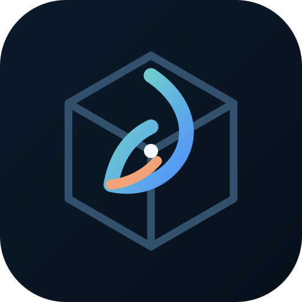

# SpatialSeed



**Ambiente espacial, procedural e orientado a comandos para criar, editar,
programar, simular e transportar mundos digitais no navegador.**

[Editor público](https://livredopodervil.github.io/SpatialSeed/apps/web/) -
[Manual do Usuário](docs/MANUAL_DO_USUARIO.md) -
[Referência Técnica](docs/REFERENCIA_TECNICA.md) -
[Livro e PDF](docs/book/README.md) -
[Mapa da documentação](docs/README.md)

> Estado: protótipo experimental em desenvolvimento ativo. O manifesto
> `apps/web/build-info.json` identifica o build publicado. Este snapshot de
> documentação viva corresponde ao build `20260818-0054mt`, preparado em 18 de
> agosto de 2026 e validado com os gates locais do projeto. O PDF v1.0 acompanha
> esta edição consolidada.

## O que o SpatialSeed é

SpatialSeed combina um editor 3D, uma linguagem procedural, um runtime de
animação e uma camada local de simulação. Seu ponto central não é uma interface
específica, mas um conjunto de contratos que permite operar o mesmo mundo por
botões, gizmos, Inspector, console, procedimentos e futuras automações sem
duplicar a lógica de domínio.

O estado lógico não pertence ao Three.js. O renderer projeta objetos; o editor
mantém seleção e previews; o sandbox registra comandos confirmados; o viewer
mantém câmera, apresentação, animação efêmera e jogo. Essa separação permite
salvar o projeto sem gravar cada quadro de uma animação ou cada passo da física.
No build `0054ms`, a recuperação persistente também é concluída antes do
lançamento automático do demo, impedindo que um modo jogo efêmero bloqueie um
rascunho recuperável.

## Três níveis de maturidade

| Nível | Significado | Exemplos nesta edição |
| --- | --- | --- |
| Implementado e verificável | Existe no código atual e possui caminho de uso ou teste | seleção, transformações, grupos, projetos, PWA, edição de malha, STL, animação efêmera e modo jogo local |
| Contrato em consolidação | A superfície pública existe, mas interação, desempenho ou semântica ainda evoluem | ferramentas por caminho, colisão por malha, personagem GLB, eventos de jogo e autoria unificada |
| Arquitetura pretendida | Direção de projeto; não deve ser apresentada como recurso entregue | colaboração remota, física geral, modificadores vinculados, booleanas robustas e gramática procedural completa |

Os documentos históricos preservam decisões e marcos. Eles não substituem o
manual atual nem o manifesto carregado.

## Primeiro uso

### Android com Termux

O servidor canônico usa HTTPS, porta 8082 e serve o checkout que contém o
script:

```bash
cd ~/SpatialSeed
python3 tools/no_cache_server.py --port 8082
```

Em outra sessão:

```bash
termux-open-url 'https://127.0.0.1:8082/apps/web/'
```

Na primeira execução, instale a autoridade certificadora local indicada pelo
servidor. Para expor o servidor a outro aparelho, acrescente `--network`.

### Desktop ou ambiente genérico

```bash
cd SpatialSeed
python3 tools/no_cache_server.py --port 8082
```

Abra `https://127.0.0.1:8082/apps/web/`. O modo `--http` serve para diagnóstico
sem TLS, mas não reproduz integralmente as condições de instalação da PWA.

Não há etapa obrigatória de compilação. A aplicação usa módulos ES e
dependências vendorizadas. Node.js é necessário para parte dos testes locais,
mas não para servir a aplicação.

## Percurso de cinco minutos

1. Abra a URL comum para carregar o projeto de demonstração.
2. Use o círculo direcional do HUD ou `WASD`, `Shift` e `Espaço`.
3. Pressione **Sair do jogo** para retornar à autoria.
4. Selecione um objeto e use mover, girar ou escalar.
5. Abra **Criar** para inserir uma geometria.
6. Abra **Inspector** para alterar propriedades.
7. Use **Salvar** para exportar um projeto `.spatialseed`.

Para começar vazio, abra `?project=new`. Para diagnóstico, abra
`?application=diagnostics`.

## Superfícies principais

| Superfície | Finalidade |
| --- | --- |
| Viewer | navegação, projeção, seleção e manipulação visual |
| Barra principal | ferramentas, painéis, projeto, modo cena e modo jogo |
| HUD Editar | nível objeto/vértice/aresta/face, ferramenta, frame, plano ativo, snap e operações contextuais |
| Inspector | propriedades literais, parâmetros geométricos e expressões em lote |
| Criar | geometrias paramétricas e posicionamento |
| Animação | presets e faixas temporais efêmeras |
| Console | comandos, consultas, procedimentos, testes e benchmarks |
| Paleta de comandos | busca unificada de ações e comandos com `Ctrl/Cmd+P` |
| Diagnóstico | testes do runtime e estado interno consultável |
| Status e comandos | seleção atual, pivô, câmera, build carregado e atualização PWA |

## Capacidades atuais

### Autoria espacial

- seleção única, múltipla, retangular, por pincel, laço e borracha;
- mover, girar e escalar nos frames mundial, local, viewer e plano ativo;
- pivôs por mediana, limites, objeto ativo ou posição personalizada;
- snapping de translação, rotação e escala;
- duplicação, repetição e séries afins;
- agrupamento e hierarquia com transformações locais;
- undo e redo de comandos confirmados;
- planos de autoria mundiais, derivados do viewer, objeto, face, três pontos ou
  superfície.

### Geometria, caminhos e malha

- catálogo declarativo de geometrias Three.js;
- parâmetros dos providers geométricos projetados no registro comum de propriedades;
- ponto, linha, polilinha, retângulo, círculo, arco e polígono sobre plano
  arbitrário;
- caminhos, tubos, varreduras e distribuição de objetos;
- edição isolada de vértices, arestas e faces;
- extrusão por normal, reta arrastada, caminho desenhado ou caminho explícito;
- operações topológicas incrementais, incluindo preenchimento, soldagem,
  subdivisão, colapso, flip, ponte e limpeza;
- importação e exportação STL.

### Aparência e renderização

- materiais compartilhados e cor por instância;
- opacidade, transparência, texturas e transformações UV;
- luzes persistentes editáveis;
- sombras, ambiente, reflexos e materiais físicos configuráveis por viewer;
- instancing, compartilhamento de recursos e projeção incremental.

### Programação e animação

- console editorial e linguagem afim indexada;
- expressões matemáticas seguras para transformação e propriedades;
- runtime JavaScript isolado em Worker + SES;
- procedimentos importáveis e exportáveis;
- planos revisáveis antes do commit atômico;
- animação temporal efêmera de transformações e cores;
- sessões temporais compartilháveis entre viewers locais.

### Jogo e personagem

- sessão de jogo efêmera no viewer;
- movimento combinável, corrida, salto, gravidade e respawn;
- locomoção relativa à câmera ou ao mundo;
- broad phase espacial e colisores de caixa, esfera e malha triangular;
- câmera de terceira pessoa com prevenção de atravessamento;
- visual GLB independente do proxy físico;
- música, efeitos e eventos básicos de jogo;
- projeto de demonstração dirigido por manifesto.

### Projeto e operação local

- arquivos `.spatialseed` portáteis;
- recuperação local por checkpoint e journal;
- PWA instalável e modo offline após o primeiro carregamento;
- múltiplos viewers locais coordenados por revisão;
- objetos câmera persistentes e câmera de navegação local;
- build publicado, build controlador e atualização PWA visíveis no painel de
  status.

## Console: exemplos mínimos

Consulte sempre `help` na versão carregada. Exemplos:

```text
help
create box size 2 1 3
move 2 0 0
rotate 0 30 0
duplicate
repeat count 8
property set appearance.color #44aaff
animate spin speed=45 axis=y
animate stop
game status
```

Uma série paramétrica:

```text
create sphere radius 0.3 count 40 move "4*cos(i*pi/20)" 0 "4*sin(i*pi/20)"
```

## Testes

Validação local da árvore:

```bash
python3 tools/run_current_gates.py
```

No perfil diagnóstico:

```text
runtime test help
runtime test all
```

O aviso `MODULE_TYPELESS_PACKAGE_JSON` emitido por Node.js é uma pendência de
metadata ESM conhecida; não representa, por si só, falha dos testes web.

## Build e PWA

O rodapé mostra o build publicado e, quando aplicável, o build do service
worker controlador. **Atualizar agora** só fica ativo quando o controlador é
diferente do build publicado ou quando um worker correspondente está sendo
instalado/aguardando ativação.

Se a atualização falhar:

1. use **Reparar atualização** quando o botão aparecer;
2. feche todas as abas e janelas instaladas do SpatialSeed;
3. reabra a origem correta;
4. confirme no status se build publicado e controlador coincidem.

Não use apenas a aparência da página para concluir qual versão foi carregada.

## Limites atuais

- o projeto é experimental e ainda não possui compatibilidade estável de
  formato entre todas as branches;
- jogo, câmera e animação são locais ao viewer e não constituem estado de rede;
- a física não é um motor geral de corpos rígidos;
- malhas triangulares ainda não usam um backend BVH universal;
- ferramentas topológicas avançadas, booleanas robustas e modificadores
  vinculados permanecem em consolidação ou no roadmap;
- STL não preserva materiais, UV, hierarquia nem animação;
- scripts de terceiros não devem ser tratados como código hostil seguro sem
  auditoria adicional;
- colaboração multiusuário remota ainda não está implementada.

## Documentação

- [Manual do Usuário](docs/MANUAL_DO_USUARIO.md): tarefas concretas e solução
  de problemas;
- [Referência Técnica](docs/REFERENCIA_TECNICA.md): contratos, módulos,
  comandos e estados;
- [Livro do SpatialSeed](docs/book/README.md): fundamentos, arquitetura, manual
  integrado e atlas procedural;
- [Mapa e política documental](docs/README.md): documentos vivos, marcos e
  snapshots históricos;
- [Decisões](docs/project/DECISIONS.md): invariantes arquiteturais;
- [Roadmap](docs/project/ROADMAP.md): capacidades futuras e critérios de saída.

## Estrutura do repositório

```text
apps/web/        aplicação mantida
packages/        módulos de domínio, projeção, interface e runtime
docs/            documentação viva e documentos de marco
docs/book/       fonte e PDF consolidado
tools/           servidor, auditorias, gates e gerador do livro
vendor/          dependências web vendorizadas
worlds/          mundos e exemplos de dados
```

## Autoria

SpatialSeed é um projeto de Rogério Duarte. Contribuições assistidas devem
preservar autoria, histórico, decisões e a distinção entre capacidade entregue,
contrato em consolidação e direção pretendida.

## Licenciamento

Consulte os arquivos de licença do repositório e das dependências vendorizadas
antes de redistribuir o projeto ou incorporar seus componentes.
