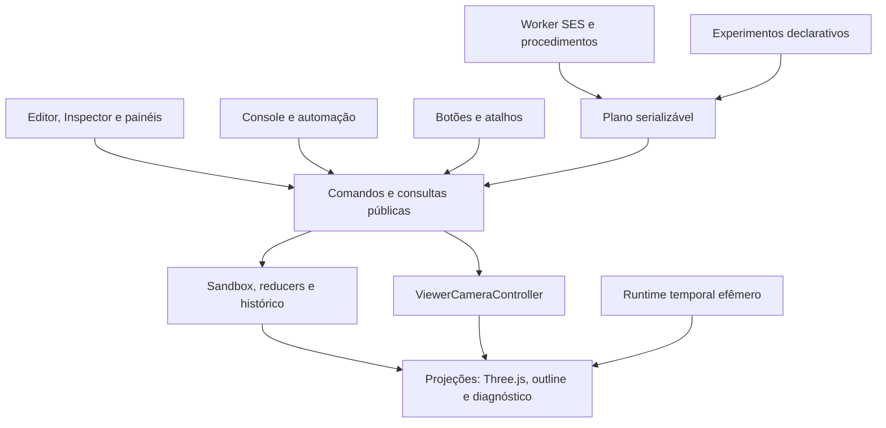

# SpatialSeed


**Um ambiente espacial, procedural e orientado a comandos para criar, editar, programar, salvar e habitar mundos digitais.**

[Portal no GitHub Pages](https://livredopodervil.github.io/SpatialSeed/) · [Abrir o editor](https://livredopodervil.github.io/SpatialSeed/apps/web/) · [Experimentos](https://livredopodervil.github.io/SpatialSeed/apps/web/experiments/) · [Livro e manual](docs/book/SpatialSeed_Livro_Manual_e_Atlas_Procedural_v0.6.pdf) · [Documentação técnica](docs/) · [Decisões do projeto](docs/project/DECISIONS.md)

> **Estado:** protótipo experimental em desenvolvimento ativo. A versão pública acompanha o branch `main`; branches `feature/*` podem conter capacidades mais recentes ainda em validação.

## O que é

SpatialSeed começou como um editor WebGL para dispositivos móveis, mas seu objetivo é mais amplo que o de um editor 3D convencional. O projeto investiga como um mundo digital pode conservar identidade, memória e regras próprias enquanto é operado por interfaces diferentes: botões, gizmos, inspetores, console, programas, automações e, futuramente, agentes e simuladores.

A cena manual e a produção procedural não são sistemas paralelos. Ambas usam a mesma camada pública de comandos. Uma cor aplicada no Inspector, uma transformação feita pelo gizmo e uma série criada no console percorrem os mesmos contratos de domínio, histórico e validação.

O resultado atual combina:

- editor 3D responsivo para toque, mouse e teclado;
- linguagem afim para repetições e construções paramétricas;
- runtime JavaScript isolado para cálculos, funções e procedimentos;
- câmera de navegação controlável por painel, console e procedimentos;
- hierarquia de grupos aninháveis com transformações locais;
- propriedades, materiais, texturas e cores de instância editáveis em lote;
- renderização local configurável por viewer, com sombras, ambiente PMREM,
  materiais físicos, transmissão, dispersão e iridescência;
- aplicação web instalável, utilizável offline depois do primeiro carregamento;
- recuperação automática local por checkpoint e comandos confirmados;
- múltiplos viewers locais sobre o mesmo sandbox, com câmeras e seleções
  independentes;
- projetos independentes criados ou abertos explicitamente em novas abas;
- objetos câmera persistentes, hierárquicos e ativáveis por viewer;
- preview de transformações entre viewers, inclusive para operar uma câmera
  enquanto outra aba fornece a saída;
- animações efêmeras sincronizadas por definição e relógio absoluto entre esses
  viewers;
- testes, diagnósticos, auditoria de recursos e benchmarks executáveis no próprio aplicativo.

## Por que existe

Em muitos sistemas, cada interface reimplementa parte da lógica: o botão faz uma coisa, o console faz outra e a automação conhece apenas uma fração do editor. SpatialSeed adota a direção oposta:

1. uma operação espacial é definida uma única vez como comando;
2. interfaces apenas traduzem intenção para esse comando;
3. o sandbox valida e registra a mudança de forma atômica;
4. renderizadores projetam o estado, mas não são donos dele;
5. programas produzem planos revisáveis antes de alterar a cena.

Isso permite que edição manual, geração procedural, testes e futuras interfaces compartilhem comportamento sem duplicar a lógica do mundo.

## Experimente agora

O portal público, com introdução e manual breve, está em:

**https://livredopodervil.github.io/SpatialSeed/**

A aplicação mantida continua em:

**https://livredopodervil.github.io/SpatialSeed/apps/web/**

O catálogo canônico distingue o laboratório integrado dos protótipos
históricos e explicita dependências e limitações:

**https://livredopodervil.github.io/SpatialSeed/apps/web/experiments/**

No menu **Projeto**, use **Como instalar** para adicionar o PWA ao aparelho. O primeiro acesso precisa de rede; depois que o service worker instalar os recursos, o aplicativo pode abrir offline.

O build efetivamente carregado aparece no rodapé. Se a publicação e o cache controlador forem diferentes, feche todas as janelas do aplicativo e abra-o novamente.

## Renderização do viewer

O menu **Painéis → Render** controla iluminação, sombras, reflexos ambientais e materiais físicos apenas no viewer atual. A configuração não altera o mundo nem o arquivo do projeto. Consulte [Renderização local do viewer — build 0032a](docs/VIEWER_RENDERING_0032A.md).

## Edição de malha

O botão **Editar** abre um workspace único para seleção, transformação, criação, materiais, luzes e edição de malha. Um HUD destacável mantém sempre disponíveis nível objeto/vértice/aresta/face, ferramenta, frame, eixos independentes, snap combinável, influência proporcional, plane lock, point lock, undo/redo interno e aplicar/cancelar. Na sessão de malha, vértices, arestas e faces do objeto ativo são os únicos componentes selecionáveis. Gizmo, comandos afins e deformações procedurais compartilham frames, travas de eixo/plano, snap adaptativo e um histórico interno independente. O falloff proporcional atua durante o arrasto do gizmo em tempo real. O painel reúne criação, exclusão, duplicação, extrusão, inset, preenchimento, divisão, subdivisão, colapso, ponte de contornos, soldagem e orientação de faces. O commit substitui a geometria em uma única entrada de undo editorial. Consulte [Edição adaptativa de malha — build 0034d](docs/MESH_EDITING_0034.md), [Gizmo proporcional em tempo real — build 0034g](docs/MESH_EDITING_0034G.md), [Edição topológica unificada — build 0035a](docs/MESH_TOPOLOGY_0035A.md) e [Workspace/HUD unificados — build 0036b](docs/EDIT_WORKSPACE_0036B.md) e [HUD contextual, luzes e materiais — build 0037c](docs/EDIT_HUD_0037C.md).

## Objetos como caminhos e perfis

A seção **Caminhos** do workspace **Editar** aceita objetos como referências geométricas. Um tubo pode fornecer sua linha central; superfícies abertas podem fornecer contornos ou arestas soltas; formas e extrusões podem fornecer perfis planares. As mesmas referências alimentam criação de tubo, varredura de perfil e distribuição hierárquica ao longo do caminho. O frame da varredura usa transporte paralelo para reduzir torções artificiais. Nesta versão, as referências são snapshots independentes, não modificadores vinculados. O build 0037b acrescenta desenho livre no plano do viewer, ajuste Bézier, criação de caminhos a partir de vértices/arestas/faces e um workspace adaptativo com HUD em grade. O build 0037c torna o HUD icônico e contextual, mantém as ferramentas essenciais visíveis, memoriza criação e materiais e introduz luzes persistentes editáveis. O build 0039e transforma a distribuição desenhada em um pincel progressivo por espaçamento, com fonte na seleção ou no catálogo e preview instanciado reutilizável. O build 0039f expõe os parâmetros completos da geometria, orienta o pincel pelo plano ou caminho e aceita expressões afins com `i`, `u`, distância e curvatura em tempo real. O build 0039g torna `u` causal por distância, conserva o prefixo já aceito, prepara as cópias lógicas durante o gesto, mantém o preview no handoff e acrescenta cor paramétrica e escala negativa por inversão cromática. A correção 0039g1 rearma traços persistentes sem recapturar recursos invariantes, aguarda a publicação observável e remove varreduras de objetos passivos das trocas de ferramenta. O build 0039g2 rearma o pincel depois de undo/redo, corrige a composição visual da cor afim para todas as geometrias e acrescenta seleção retangular, por pincel, laço e borracha com índice espacial cacheado e commit atômico. O build 0040a separa planos de visualização, edição e desenho, expõe pivô e setores cromáticos no HUD e acrescenta ponto, segmento, polilinha, retângulo, círculo, arco e polígono no plano arbitrário. O build 0040b preserva `pan/pinch` durante ferramentas, acrescenta órbita com três dedos, remove o teto do HUD, compartilha passos de grade/ângulo entre 2D e 3D e adiciona régua, transferidor e reset do viewer. Consulte [Referências espaciais e ferramentas por caminho — build 0037a](docs/PATH_REFERENCES_0037A.md), [Workspace adaptativo e curvas editáveis — build 0037b](docs/EDIT_WORKSPACE_0037B.md), [HUD contextual, luzes e materiais — build 0037c](docs/EDIT_HUD_0037C.md), [Pincel progressivo por caminho — build 0039e](docs/PATH_BRUSH_AUTHORING_0039E.md), [Parâmetros geométricos e pincel afim — build 0039f](docs/AFFINE_PATH_BRUSH_0039F.md), [Pincel causal e commit incremental — builds 0039g–0039g2](docs/INCREMENTAL_PATH_BRUSH_0039G.md), [Gestos de seleção cacheados — build 0039g2](docs/SELECTION_GESTURES_0039G2.md), [Autoria planar, pivô e ferramentas 2D — build 0040a](docs/PLANAR_AUTHORING_0040A.md) e [Multitoque, snap e medição — build 0040b](docs/MEASUREMENT_INPUT_0040B.md).

## Execução local

O projeto usa módulos ES nativos e dependências vendorizadas. Não há etapa obrigatória de compilação nem `npm install`.

### Ambiente genérico

```bash
git clone https://github.com/livredopodervil/SpatialSeed.git
cd SpatialSeed
python3 -m http.server 8082 --bind 127.0.0.1
```

Abra o portal:

```text
http://127.0.0.1:8082/
```

Ou entre diretamente no editor:

```text
http://127.0.0.1:8082/apps/web/
```

### Android com Termux

O servidor de desenvolvimento sem cache foi preparado para o diretório `~/SpatialSeed-monorepo`:

```bash
git clone https://github.com/livredopodervil/SpatialSeed.git ~/SpatialSeed-monorepo
cd ~/SpatialSeed-monorepo
python tools/no_cache_server.py
```

Em outra sessão do Termux:

```bash
termux-open-url 'http://127.0.0.1:8082/apps/web/'
```

Também está disponível o utilitário operacional:

```bash
bash tools/seedctl help
bash tools/seedctl serve
```

Um servidor HTTP é necessário porque módulos ES, import maps e service workers dependem das regras de uma origem web. Para PWA fora de `127.0.0.1` ou `localhost`, use HTTPS.

## Primeiro percurso pela interface

| Objetivo | Superfície |
| --- | --- |
| Criar caixas, esferas, cilindros/cones, planos e polígonos | **Criar** |
| Navegar, selecionar, mover, girar e escalar | barra principal e gizmo |
| Escolher seleção única/múltipla e operações de inclusão/remoção | **Seleção** |
| Alterar pivô, snapping e visualização do gizmo | **Transformar** |
| Agrupar, desagrupar, desfazer e refazer | **Editar** |
| Editar propriedades literais ou procedurais, inclusive abrindo grupos | **Inspector** |
| Reproduzir presets ou compor faixas diferentes por objeto | **Animação** |
| Posicionar, orientar, orbitar, enquadrar e configurar o recorte | **Câmera** |
| Criar, ativar, selecionar, capturar e escolher objetos câmera | **Câmera → Câmeras do projeto** |
| Conectar viewers ou abrir projetos independentes | **Projetos / viewers** |
| Executar laboratórios paramétricos que geram planos revisáveis | **Explorar** |
| Ver árvore regional, diagnóstico, recursos e console | **Painéis** |
| Salvar, abrir, instalar e trocar catálogos de procedimentos | **Projeto** |
| Inspecionar a recuperação automática local | console: `recovery status` |

Os painéis são móveis e redimensionáveis. Sua disposição, o layout da barra e preferências de apresentação ficam no armazenamento local do navegador. A composição inicial é declarada em [`apps/web/config/ui.default.json`](apps/web/config/ui.default.json), sem duplicar operações do domínio.

## Capacidades atuais

### Edição e seleção

- seleção única, múltipla, alternada e por área;
- operações explícitas de substituir, incluir, remover e alternar membros;
- transformações em espaço mundial ou local;
- pivôs por mediana, limites, objeto ativo ou posição personalizada;
- snapping de translação, rotação, escala e grade;
- preview visual separado do commit da transformação;
- escala proporcional nos três eixos pela alça central branca `XYZ`;
- undo e redo locais sobre comandos confirmados.

### Hierarquia

- grupos lógicos com âncora e transform local;
- grupos potencialmente aninháveis;
- transformação, duplicação e exclusão de subárvores completas;
- desagrupamento de um nível sem deslocamento no espaço mundial;
- caixa de seleção, highlight e gizmo projetados para a unidade lógica;
- preservação das relações internas quando o pivô ou o grupo se move.

### Geometrias e aparência

- 21 famílias geométricas declarativas, cobrindo todas as geometrias de malha do núcleo Three.js r185 compatíveis com o renderer atual;
- criação em planos `XY`, `XZ` e `YZ`, por normal/tangente ou por três pontos;
- descritores paramétricos fornecidos pelo `GeometryRegistry`, incluindo toro, nó toroidal, cápsula, poliedros, revolução, tubo, forma, extrusão e malha `BufferGeometry`;
- cor hexadecimal arbitrária, opacidade e transparência;
- textura com repetição, deslocamento, rotação e modo de wrapping;
- cor por instância sem separar desnecessariamente o lote de renderização;
- superfícies abertas renderizadas pelos dois lados;
- recursos de geometria, material e textura compartilhados e contados por referência.
- catálogo técnico: [`docs/THREE_GEOMETRY_CATALOG_0031A.md`](docs/THREE_GEOMETRY_CATALOG_0031A.md).

### Interface configurável e atalhos

- barra horizontal, vertical ou flutuante, composta pelo manifesto
  `apps/web/config/ui.default.json`;
- vários painéis móveis e redimensionáveis abertos simultaneamente;
- posições, dimensões, layout e perfil de atalhos persistidos localmente;
- ações semânticas comuns a botões e teclado;
- `Ctrl/Cmd+Z`, `Ctrl/Cmd+Shift+Z`, `Ctrl/Cmd+Y`, `Ctrl/Cmd+D`, `Delete`,
  `Backspace`, `Tab` e `F`;
- ferramentas por `Q`, `S`, `W`, `E` e `R`;
- campos textuais preservam edição e undo próprios.

### Câmera de navegação

A câmera de navegação pertence ao `ViewerState`, não ao documento espacial. O
`ViewerCameraController` mantém posição, quaternion, distância de foco, campo
visual, `near` e `far`; o alvo exibido no painel é derivado da orientação e da
distância, evitando duas fontes concorrentes de verdade.

O painel **Câmera** permite editar posição e alvo, orbitar incrementalmente,
enquadrar a seleção e restaurar a vista inicial. Essas ações não alteram o
sandbox, não entram no undo e não são salvas no arquivo `.spatialseed`.

### Objetos câmera

Objetos câmera são entidades persistentes e hierárquicas, distintas da câmera
de navegação. Podem ser criados a partir da vista atual, selecionados,
transformados, agrupados, capturados novamente e salvos no schema 3 do projeto.
Cada viewer escolhe localmente qual objeto câmera ativa; o documento pode
declarar uma câmera padrão opcional.

Ativar um objeto projeta sua pose mundial e seus parâmetros de perspectiva na
vista local. Navegar manualmente volta à câmera livre sem modificar o objeto.
Ao mover a câmera pelo gizmo, outros viewers que a estejam usando acompanham o
gesto por preview efêmero; somente o resultado final entra no undo. O painel
permite selecionar o objeto diretamente, distinguir câmera selecionada, ativa e
padrão e escolher se os frustums aparecem em todas, somente nas selecionadas ou
em nenhuma. Use `camera objects`, `camera diagnostics` e `help camera` no
console.

### Viewers locais

**Projetos / viewers** lista as identidades de sandbox ativas, conecta outra aba
ao destino escolhido e também oferece **Novo projeto em nova aba** e **Abrir
arquivo em nova aba**. Cada aba
mantém câmera, seleção e painéis próprios; objetos e histórico são coordenados
por revisão. Uma aba é a autoridade local e as demais enviam comandos canônicos
em fila. Se uma intenção foi produzida sobre revisão antiga, ela é rejeitada, o
viewer recebe o estado atual e a ação pode ser repetida conscientemente.

Use `viewers status`, `viewers sessions`, `viewers open [sandboxId]` e
`viewers sync` no console. Ao fechar a autoridade, uma réplica automática assume
o projeto e seu diário de recuperação. Essa
coordenação usa `BroadcastChannel` na mesma origem e não deve ser confundida com
colaboração remota ou multiusuário.

Um viewer que entra numa sessão existente aguarda o primeiro snapshot antes de
participar da sucessão de autoridade. Isso evita tratar uma entrada ainda não
sincronizada como um projeto vazio recuperável. Arquivos enviados a uma nova aba
usam um canal transitório e não são guardados no diretório de sessões.

Sessões de animação efêmera também atravessam esses viewers, mas por um
protocolo temporal separado do snapshot editorial. A definição e uma época
comum são distribuídas; cada aba calcula seus próprios quadros. Câmera, seleção
e painéis permanecem locais.

### Produção afim

O console pode criar até 100.000 objetos em uma série atômica. As expressões conhecem o índice `i`, o parâmetro normalizado `u`, a quantidade `count`, constantes e funções matemáticas.

Exemplo: quarenta esferas distribuídas em um círculo.

```text
create sphere radius 0.3 count 40 move "4*cos(i*pi/20)" 0 "4*sin(i*pi/20)"
```

Exemplo: vinte caixas submetidas a translação e rotação paramétricas.

```text
create box size 1 1 1 count 20 move 1 0 0 rotate 0 9 0
```

Esses comandos chamam diretamente a mesma operação `object.create.geometrySeries` usada pelo painel **Criar**.

## Console e linguagem

O console reúne comandos editoriais, consultas, testes, benchmarks e um runtime
de programas. Use `help`, `help create`, `help camera` e `procedure help` para
obter a ajuda gerada pela própria versão carregada.

### Comandos editoriais

```text
create polygon 6 radius 2 plane xz origin 0 0 0 color #33aaff
move 2 0 0
rotate 0 30 0
scale 1 2 1
duplicate
repeat
group Estrutura
ungroup
delete
undo
redo
```

### Propriedades compartilhadas

O Inspector e o console consultam o mesmo `PropertyRegistry`:

```text
property list
property inspect
property set appearance.color #33aaff
property set texture.repeat 4 2
property set texture.rotationDeg 15
property set instance.color #ff8a3d
property unset instance.color
```

Uma edição sobre vários objetos é validada por inteiro e gera uma única entrada de histórico. Valores mistos permanecem identificáveis; campos não tocados não são sobrescritos.

O Inspector também pode avaliar uma expressão por alvo. O escopo
`renderables` abre grupos aninhados e preserva o nó lógico:

```text
property batch instance.color "hsl(300*u,0.8,0.55)" scope=renderables
property batch transform.position "x; y + 2*sin(tau*u); z"
```

A expressão é compilada uma vez; qualquer erro rejeita o lote inteiro antes da
primeira mutação.

### Calculadora e sessão persistente

`calc` avalia expressões JavaScript. `program` aceita funções, objetos, estruturas de controle e `return`. Somente valores colocados em `session` persistem entre execuções.

```text
calc sqrt(3 ** 2 + 4 ** 2)
calc session.radius = 12
program session.area = r => pi * r ** 2
calc session.area(session.radius)
session status
```

O namespace de sessão pertence a um Worker isolado. `session reset` encerra esse estado de cálculo sem alterar a cena.

### Câmera pelo console

O console chama os mesmos comandos do painel:

```text
camera status
camera position 10 8 14
camera lookat 0 1 0
camera orbit 30 -10
camera frame 1.2
camera projection 0.1 2000 55
```

`camera quaternion x y z w` define a orientação diretamente. Os quatro
componentes `x`, `y`, `z` e `w` formam o quaternion normalizado usado como
orientação autoritativa.

### Programas espaciais e commit atômico

Programas não recebem acesso direto ao sandbox, renderer, DOM, rede ou sistema de arquivos. Eles recebem apenas capacidades explícitas e podem produzir intenções com `spatial.create`.

Execute primeiro:

```text
program
const count = 24;
for (let i = 0; i < count; i += 1) {
  const angle = i * tau / count;
  spatial.create("sphere", {
    radius: 0.25,
    position: [4 * cos(angle), 0.5, 4 * sin(angle)],
    color: i % 2 ? "#4f8ef7" : "#ef8354"
  });
}
return { count };
```

O programa termina sem tocar a cena. Revise e confirme em uma segunda execução:

```text
plan status
plan commit
```

O commit valida versão, orçamento, geometrias, posições e aparências; simula o comando no reducer; e só então publica todos os objetos em uma transação com um único item de undo. `plan discard` abandona o plano sem efeito.

### Procedimentos e catálogos

Procedimentos são funções nomeadas cujo código-fonte fica separado do projeto espacial.

```text
procedure define tower ({height=8,color="#4488ff"}={}) => spatial.create("box", {
  size:[2,height,2], position:[0,height/2,0], color
})
```

Depois execute, revise e confirme:

```text
procedure run tower {"height":12,"color":"#d48676"}
plan status
plan commit
```

O menu **Projeto** importa e exporta catálogos JSON editáveis em outros editores. O **Editor de procedimentos** permite manter fontes nomeadas com numeração de linhas, quebra visual e realce léxico. Importar uma biblioteca nunca executa seu código; a avaliação só ocorre quando o usuário chama `procedure run`.

Procedimentos também podem planejar operações locais da câmera:

```text
procedure define orbit ({degrees=30}={}) => camera.orbit({yawDegrees:degrees})
procedure run orbit {"degrees":45}
plan status
plan commit
```

O Worker recebe apenas a fachada `camera.*`. O plano não pode misturar
mutações espaciais persistentes e câmera local na mesma transação.

### Experimentos declarativos

O laboratório em **Explorar** apresenta definições registradas pelo plugin
interno de experimentos. Parâmetros tipados geram controles; painel e console
produzem o mesmo plano:

```text
experiment list
experiment show math.helix
experiment helix radius=4 turns=5 count=160 color=#5b8bd9
plan status
plan commit
```

O experimento não fornece HTML nem acessa DOM, renderer ou sandbox. A API ainda
é interna e não instala JavaScript externo.

O catálogo em [`apps/web/experiments/`](apps/web/experiments/) também preserva
protótipos independentes anteriores ao laboratório atual. Eles são evidência
histórica, não extensões do runtime mantido. O manifesto
[`catalog.json`](apps/web/experiments/catalog.json) registra maturidade,
execução offline, dependências e limites conhecidos de cada entrada. Desde o
0029b, os sete snapshots algébricos usam Math.js local e compartilham controles
de seleção móvel, recorte e salvamento nomeado.

### Animação efêmera

O painel **Animação** e o console controlam a mesma sobreposição temporal:

```text
animate spin speed=45 axis=y
animate wave amplitude=1 frequency=0.5 phase=0.35 mode=objects
animate rainbow speed=60 saturation=0.8 mode=objects
animate color "hsl(60*t + 360*u,0.8,0.55)" mode=objects
animate pause
animate resume
animate status
animate stop
```

`mode=selection` mantém cada raiz selecionada como unidade rígida;
`mode=objects` abre grupos em objetos renderizáveis, permitindo movimentos e
cores diferentes. Faixas do painel podem usar programas distintos por alvo.
Animação é preview: não altera o sandbox, não cria histórico, não é salva no
projeto e `animate stop` restaura matrizes e cores canônicas. Nos viewers locais
do mesmo sandbox, iniciar, pausar, retomar ou parar controla uma única sessão
efêmera. O tempo deriva de uma época absoluta; uma aba reativada ou aberta
durante a execução alcança diretamente o instante vigente.

## Arquitetura


```mermaid
flowchart TD
    UI["Editor, Inspector e painéis"] --> API["Comandos e consultas públicas"]
    CONSOLE["Console e automação"] --> API
    SCRIPT["Worker SES e procedimentos"] --> PLAN["Plano serializável"]
    EXP["Experimentos declarativos"] --> PLAN
    ACTION["Botões e atalhos"] --> API
    PLAN --> API
    API --> SANDBOX["Sandbox, reducers e histórico"]
    API --> CAMERA["ViewerCameraController"]
    SANDBOX --> VIEW["Projeções: Three.js, outline e diagnóstico"]
    CAMERA --> VIEW
    TIME["Runtime temporal efêmero"] --> VIEW
```

### Princípios preservados

- **Uma fonte de verdade para operações:** GUI, console e programas convergem na camada de comandos.
- **Lógica separada da visualização:** o renderer projeta estado e previews, mas não define regras editoriais.
- **Atomicidade:** operações em lote são normalizadas antes da mutação e entram juntas no histórico.
- **Capacidades mínimas:** programas só conhecem APIs explicitamente concedidas.
- **Determinismo:** expressões, geradores aleatórios com semente e planos serializáveis favorecem reprodução e teste.
- **Extensão por registros:** famílias geométricas e propriedades entram por descritores, sem condicionais espalhadas pela interface.
- **Mundo e sandbox distintos:** a edição acontece localmente; a arquitetura reserva uma fronteira para revisão, autoridade e publicação regional.

### Pacotes principais

| Pacote | Responsabilidade |
| --- | --- |
| `packages/core` | região, sandbox e eventos |
| `packages/runtime-api` | fachada pública de comandos, consultas, eventos e capacidades |
| `packages/runtime-layers` | estado local do viewer, controlador de navegação e serviço de objetos câmera |
| `packages/local-viewers` | coordenação editorial/temporal e lançamento transitório entre abas |
| `packages/editor-commands` | registro canônico das operações editoriais |
| `packages/region-box` | reducer puro e modelo de estado da região atual |
| `packages/scene-hierarchy` | grupos, parentesco, transforms locais e ciclo de subárvores |
| `packages/geometry-registry` | famílias paramétricas e providers de geometria |
| `packages/mesh-editor-core` | sessão, meia-aresta transitória, operações de vértices/arestas/faces, restrições, snapping, deformação procedural e histórico interno |
| `packages/mesh-edit-panel` | workspace declarativo de objeto e malha |
| `packages/edit-context` | estado efêmero unificado de ferramenta, frame, eixos, snap e travas |
| `packages/edit-hud` | HUD destacável de ações de alta frequência |
| `packages/spatial-references` | resolução de objetos como caminhos, perfis e pontos; frames de transporte e ferramentas por trajetória |
| `packages/property-registry` | propriedades tipadas, inspeção e edição atômica em lote |
| `packages/script-runtime` | Workers, SES, sessões, planos espaciais/de câmera e procedimentos |
| `packages/experiment-runtime` | definições, parâmetros e planejamento de experimentos |
| `packages/experiment-panel` | painel declarativo do laboratório |
| `packages/ui-config` | manifesto e perfil de atalhos |
| `packages/ui-widgets` | ações, barra e painéis configuráveis |
| `packages/animation-runtime` | relógio, programas, presets e faixas efêmeras |
| `packages/animation-panel` | composição visual e controles de reprodução |
| `packages/renderer-three` | projeção WebGL, instancing, picking, highlights e gizmos |
| `packages/appearance-runtime` | aparências normalizadas, compartilhamento e projeção legada |
| `packages/project-files` | validação, serialização e abertura de projetos |
| `packages/project-recovery` | identidade, journal IndexedDB e restauração local |
| `packages/runtime-test-plugin` | testes arquiteturais executáveis no aplicativo |
| `apps/web` | composição concreta da PWA e suas superfícies visuais |

Consulte [`docs/ARCHITECTURE.md`](docs/ARCHITECTURE.md),
[`docs/COMMAND_ARCHITECTURE.md`](docs/COMMAND_ARCHITECTURE.md),
[`docs/SCRIPT_RUNTIME_0026A.md`](docs/SCRIPT_RUNTIME_0026A.md),
[`docs/EXPERIMENT_PLUGIN_0027A.md`](docs/EXPERIMENT_PLUGIN_0027A.md),
[`docs/INTERACTION_SURFACE_0028C.md`](docs/INTERACTION_SURFACE_0028C.md) e
[`docs/ANIMATION_WORKSPACE_0028D.md`](docs/ANIMATION_WORKSPACE_0028D.md).
O protocolo local atual está em
[`docs/project/LOCAL_VIEWER_COORDINATION.md`](docs/project/LOCAL_VIEWER_COORDINATION.md).
O contrato de câmera está dividido entre
[`docs/project/VIEWER_CAMERA_CONTROLLER.md`](docs/project/VIEWER_CAMERA_CONTROLLER.md)
e [`docs/project/CAMERA_OBJECTS.md`](docs/project/CAMERA_OBJECTS.md).

## Projetos, arquivos e funcionamento offline

- **Salvar** produz um documento `.spatialseed`/JSON validado e portável e
  sempre oferece a escolha do nome;
- **Abrir** usa a File System Access API quando disponível e mantém um fallback por seletor/download em navegadores móveis.
- texturas e aparências compartilhadas são armazenadas como assets do projeto;
- criar um projeto novo descarta a referência ao arquivo anterior, evitando sobrescrita acidental;
- o PWA guarda os arquivos do aplicativo para uso offline;
- o IndexedDB conserva um checkpoint local e os comandos editoriais confirmados
  do sandbox;
- ao reabrir, checkpoints limpos continuam automaticamente; rascunhos oferecem
  **Continuar**, **Exportar cópia** ou **Descartar**;
- seleção, câmera de navegação, câmera ativa, painéis e animação não entram na
  recuperação; objetos câmera e a câmera padrão pertencem ao documento;
- limpar os dados do navegador pode apagar a recuperação local;
- a cópia portátil do trabalho continua sendo responsabilidade de **Salvar** e
  **Abrir**.

Compactação procedural e armazenamento de blobs grandes em OPFS continuam no
roadmap.

## Testes, diagnóstico e desempenho

Os testes principais rodam dentro da aplicação porque exercitam os mesmos módulos usados pelo navegador. No console:

```text
runtime test all
runtime test procedure-catalog
runtime test spatial-plan-commit
runtime test property-contract
runtime test geometry-creation
runtime test mesh-edit-math
runtime test mesh-topology
runtime test file-interop
runtime test project-recovery
runtime test experiment-contract
runtime test experiment-panel
runtime test ui-actions
runtime test animation-runtime
runtime test animation-tracks
runtime test viewer-animation
runtime resources
```

Benchmarks ficam isolados da cena ativa:

```text
benchmark scene 1000 10 100
benchmark history
benchmark compare
```

O histórico comparativo e as linhas de base estão em [`docs/performance/`](docs/performance/) e em [`docs/BENCHMARKS_AND_TESTS.md`](docs/BENCHMARKS_AND_TESTS.md).

Para conferir o manifesto offline depois de criar, remover ou renomear módulos estáticos:

```bash
python3 tools/generate_pwa_precache.py
python3 tools/generate_pwa_precache.py --check
```

Para auditar a raiz pública, o catálogo e todos os destinos históricos sem
acessar a rede:

```bash
python3 tools/audit_web_entrypoints.py
```

## Estrutura do repositório

```text
index.html                portal, introdução e manual breve
apps/web/                 aplicação web e PWA
apps/web/experiments/     catálogo canônico de experimentos
apps/experiments/         protótipos independentes preservados
packages/                 contratos e implementações modulares
docs/                     arquitetura, decisões, testes e desempenho
docs/project/             estado, roadmap e continuidade do projeto
tools/                    servidor, precache, auditoria e utilitários
vendor/                   Three.js, add-ons, SES e Math.js vendorizados
AGENTS.md                  entrada operacional para assistentes
PROJECT_SEED.md            semente técnica para retomada do projeto
```

O protótipo que antes ocupava a raiz foi preservado em
`apps/experiments/root-region-prototype/`. A raiz agora é somente uma superfície
de orientação; a aplicação mantida permanece em `apps/web/`.

## Desenvolvimento e contribuição

O desenvolvimento é incremental: uma mudança arquitetural pequena por commit, teste automático, verificação visual no navegador e só então integração ao `main`.

Fluxo recomendado:

```bash
git switch main
git pull --ff-only origin main
git switch -c feature/NNNN-descricao-curta
```

Antes de integrar:

```bash
git status --short
git diff --check
python3 tools/audit_web_entrypoints.py
python3 tools/generate_pwa_precache.py --check
```

Abra a aplicação, execute `runtime test all` e faça os testes visuais correspondentes à alteração. Mudanças de interface não devem criar uma segunda implementação de comportamento: exponha ou reutilize o comando público e faça a superfície visual chamá-lo.

Commits devem preservar a autoria efetiva. Quando houver assistência técnica automatizada, ela pode ser registrada sem substituir o autor:

```text
Assisted-by: OpenAI Codex
```

As decisões de workflow estão documentadas em [`docs/project/WORKFLOW.md`](docs/project/WORKFLOW.md) e [`docs/WORKFLOW.md`](docs/WORKFLOW.md). Assistentes devem começar por [`AGENTS.md`](AGENTS.md) e [`PROJECT_SEED.md`](PROJECT_SEED.md).

## Limites atuais

SpatialSeed ainda não é um modelador DCC completo nem um motor de jogo pronto para produção. Permanecem fora do escopo implementado:

- operações topológicas avançadas de DCC, como bevel, knife, loop cut, remalhamento e UVs por canto;
- relações vinculadas por modificadores, curvas 2D compostas e edição independente de atributos por canto ainda não estão implementadas;
- persistência de clips, keyframes e animações no documento;
- eventos, colisões e interatividade programável contínua;
- serialização compacta de grandes receitas procedurais e instâncias hierárquicas;
- colaboração multiusuário e autoridade distribuída em produção;
- importação e exportação completas de formatos como glTF, STL e Collada;
- auditoria de segurança suficiente para executar código não confiável em contexto crítico.

Esses limites são mantidos explícitos para evitar que uma demonstração seja confundida com uma garantia de produção.

## Próximos marcos

1. consolidar origens individuais, grupos e customização interna da interface;
2. decidir persistência de clips/keyframes e modelo de eventos;
3. sanitização e operações booleanas robustas entre objetos;
4. geometria 2D, polylines, curvas Bézier e referências vinculadas por modificadores;
5. ampliar o editor topológico com bevel, knife, loops, UVs e assets de malha compartilhados;
6. persistência compacta, formatos 3D e colaboração regional.

Os registros de planejamento e prioridades anteriores permanecem em [`docs/project/ROADMAP.md`](docs/project/ROADMAP.md).

## Autoria e colaboração

**Concepção, autoria e direção do projeto:** Rogério Duarte.

O desenvolvimento registra assistência técnica do OpenAI Codex nos commits correspondentes, sem transferir a autoria do projeto ou das decisões ao assistente.

## Licenciamento

Este repositório ainda não contém um arquivo `LICENSE`. A publicação do código-fonte não concede, por si só, uma licença ampla de cópia, redistribuição ou exploração comercial. Até que uma licença seja formalmente escolhida, os direitos permanecem reservados ao autor.
