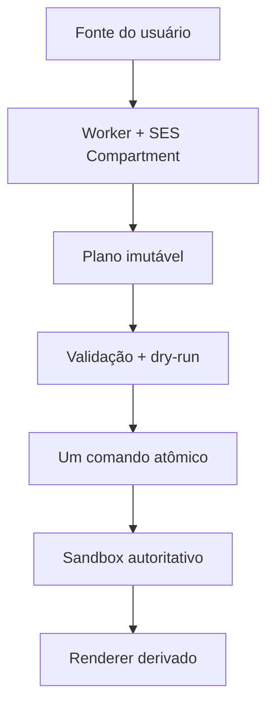

# Modelo de segurança do SpatialSeed

> Especificação normativa P0. Auditada em 16 de julho de 2026 contra o runtime
> `0026j`. O código e os testes do branch carregado prevalecem se este documento
> divergir deles.

## 1. Objetivo e alcance

Este documento define a fronteira de confiança do runtime de programas, dos
catálogos de procedimentos, dos planos espaciais, dos arquivos de projeto e da
aplicação web/PWA. Ele descreve garantias implementadas, ameaças consideradas e
lacunas conhecidas. Não constitui auditoria independente nem prova formal.

As palavras **DEVE**, **NÃO DEVE**, **DEVERIA** e **PODE** são normativas no
sentido do BCP 14, adaptadas ao português.

## 2. Princípio central

Código fornecido pelo usuário não recebe o mundo editorial. Recebe somente
capacidades explícitas, calcula em uma fronteira isolada e pode devolver um
plano serializável. A cena só muda depois de validação e commit no processo
principal.



O renderer NÃO DEVE ser fonte de autoridade, e o programa NÃO DEVE obter uma
referência ao sandbox, ao registro de comandos ou ao renderer.

## 3. Ativos protegidos

1. estado e histórico editorial da cena;
2. identidade, hierarquia e transforms dos objetos;
3. grafo de aparências e assets;
4. seleção e estado local do editor;
5. arquivos escolhidos pelo usuário;
6. origem web, cache da PWA e dependências executadas;
7. disponibilidade da interface principal;
8. catálogo de fontes do usuário.

## 4. Atores e ameaças

| Ator ou evento | Considerado | Tratamento atual |
| --- | --- | --- |
| erro acidental em programa | sim | erro fechado; sessão invalidada |
| loop síncrono infinito | sim | timeout e término do Worker |
| programa tentando emitir comandos demais | sim | orçamento antes do plano |
| programa tentando usar comando/geometria não autorizada | sim | capability e allowlist |
| mensagem falsa ou atrasada de Worker | sim | protocolo, token e envelope validados |
| arquivo ou catálogo JSON malformado | sim | parse e validação antes da troca de estado |
| plano produzido sobre revisão antiga | sim | conflito de `baseVersion` |
| falha ao internar aparências | sim | restauração do grafo anterior |
| exaustão por arquivo enorme ou Base64 | parcialmente | sem limite global de bytes hoje |
| script malicioso servido pela própria origem | parcialmente | Worker/SES não protegem o app hospedeiro comprometido |
| comprometimento do navegador/SO | não | fora do modelo |
| extensão de navegador privilegiada | não | fora do modelo |
| ataque físico ao aparelho desbloqueado | não | fora do modelo |

## 5. Fronteiras de confiança

### 5.1 Processo principal

É confiável para aplicar comandos e armazenar o estado autoritativo. UI,
console, inspector e programas DEVERIAM convergir para a mesma camada pública
de comandos. Código de domínio NÃO DEVE depender de elementos DOM.

### 5.2 Worker de programa

Cada sessão usa um Worker dedicado. Uma execução descartável usa Worker próprio.
O controlador:

- mantém token privado por execução;
- aceita somente o protocolo `spatial-seed-program-worker-v1`;
- valida `runId`, versão-base, tipo do envelope e versão do plano;
- rejeita execução concorrente;
- encerra o Worker em timeout, cancelamento, falha ou descarte;
- ignora resposta tardia cujo token não seja mais atual.

O timeout padrão é **5.000 ms**. Ele é uma barreira de disponibilidade, não uma
medida precisa de CPU. O navegador pode atrasar timers em segundo plano.

### 5.3 SES Compartment

O Worker carrega a cópia vendorizada de SES, chama:

```js
lockdown({
  errorTaming: "safe",
  consoleTaming: "safe",
  overrideTaming: "severe"
})
```

e avalia o programa em `Compartment` com endowments endurecidos. `lockdown`
reduz e congela a superfície de JavaScript compartilhada; o `Compartment`
fornece um global separado e somente as capacidades entregues pelo host.

Essa fronteira DEVE continuar sendo testada negativamente. A presença de SES
NÃO autoriza afirmar que todo o aplicativo é seguro: dependência comprometida,
erro de integração ou nova capability perigosa pode quebrar o modelo.

### 5.4 Fronteira de dados

Pedidos, snapshots, argumentos, resultados, planos e mensagens atravessam
`structuredClone`. Funções, símbolos, nós DOM e outros valores não clonáveis
NÃO atravessam. Valores persistentes em `session` permanecem dentro do Worker.

`structuredClone` fornece cópia e rejeição de tipos não serializáveis; não é
validação semântica. Todo valor que se torne comando ainda DEVE passar por
validação de domínio.

## 6. Capacidades do programa

### 6.1 Sempre oferecidas

| Nome | Poder |
| --- | --- |
| constantes e funções matemáticas | cálculo puro com `Number` |
| `random`, `randomInt`, `randomSeed` | PRNG determinístico por semente |
| `print` | saída textual limitada |
| `snapshot` | cópia somente para leitura por isolamento, não referência viva |
| `session` | namespace privado persistente no Worker de sessão |

O host não fornece DOM, `window`, runtime, renderer, seletor de arquivos ou
cliente de rede como endowments. Novas capabilities DEVEM ser opt-in, mínimas e
acompanhadas de modelo de ameaça e testes negativos.

### 6.2 Capability `spatial`

`spatial` só existe quando `object.create.geometry` está autorizado. Ela expõe:

- `spatial.geometries`: famílias permitidas;
- `spatial.create(type, options)`: adiciona intenção ao plano;
- `spatial.stats()`: contagem de comandos e geometrias permitidas.

`spatial.create` NÃO cria objeto real. O handle retornado é local e determinístico
para `runId`, tipo e sequência. A lista de geometrias vem do registro efetivo.

### 6.3 Ausências deliberadas

O programa atual:

- NÃO executa operações assíncronas;
- NÃO faz commit automático;
- NÃO importa módulos arbitrários;
- NÃO lê nem grava arquivos;
- NÃO acessa DOM ou WebGL;
- NÃO recebe eventos ou tempo de animação como capability de host;
- NÃO edita objetos existentes; a capability atual apenas planeja criação.

## 7. Limites implementados

| Recurso | Limite atual | Local de imposição |
| --- | ---: | --- |
| fonte de programa | 100.000 caracteres | `ProgramWorkerKernel` |
| fonte por procedimento | 100.000 caracteres | `ProcedureCatalog` |
| tempo de execução | 5.000 ms por padrão | controladores de Worker |
| intenções por plano | 10.000 por padrão | `DisposableProgramRun` |
| linhas de `print` | 100 por padrão | ambiente de cálculo |
| programa assíncrono | proibido | resultado Promise-like é rejeitado |
| plano pendente no console | 1 | `DevConsole` |

Esses valores são defaults de implementação, não cotas universais. Alterá-los
exige teste de disponibilidade e atualização desta tabela.

## 8. Sessões persistentes

`session` é um objeto sem protótipo mantido no Worker. Uma avaliação concluída
incrementa a revisão da sessão. Funções podem permanecer ali, mas não podem ser
devolvidas ao processo principal.

Qualquer erro, timeout, cancelamento ou envelope inválido DEVE:

1. rejeitar a avaliação;
2. terminar o Worker;
3. zerar chaves e revisão reportadas;
4. exigir nova geração antes de reutilizar a sessão.

`session reset` afeta apenas estado privado de cálculo e NÃO DEVE alterar a
cena. O catálogo é separado da sessão.

## 9. Planos e commit

Um plano possui versão `spatial-seed-program-plan-v1`, `runId`, `baseVersion`,
semente, comandos e resultado. Antes do commit, o processo principal DEVE:

1. validar versão do plano e revisão atual do sandbox;
2. validar sequência, comando, handles e argumentos;
3. normalizar geometria pelo `GeometryRegistry`;
4. resolver placement e validar vetores finitos;
5. normalizar cor;
6. gerar IDs reais sem colisão;
7. simular o comando agregado no reducer puro;
8. confirmar que o sandbox não mudou durante a validação;
9. internar aparências e despachar uma única transação.

Se o commit de recursos falhar, o grafo de aparências anterior DEVE ser
restaurado. Um plano obsoleto NÃO DEVE ser reaplicado silenciosamente.

## 10. Catálogos de procedimentos

O catálogo guarda **fonte**, não função viva. Importar, editar ou persistir um
catálogo NÃO executa código. Execução só ocorre por `procedure run`, dentro da
mesma fronteira SES, e efeitos continuam pendentes até `plan commit`.

O formato aceita nomes por `^[A-Za-z_][A-Za-z0-9_.-]*$`. `merge` rejeita
conflito de fonte sem alteração parcial; `replace` substitui o documento inteiro.
No navegador, a persistência atual usa `localStorage`; limpar os dados da origem
pode apagar o catálogo.

## 11. Arquivos de projeto

O parser valida JSON, identificador de formato, versões aceitas, lista de
objetos, IDs únicos e presença básica do catálogo de assets. O `AssetStore`
recalcula content IDs na importação.

Limitações atuais importantes:

- não há limite explícito de bytes, objetos, profundidade de hierarquia ou
  tamanho de textura;
- `ProjectValidator` ainda não valida todos os vetores, descritores, relações
  pai-filho e referências entre objeto, aparência, material e textura;
- JSON válido pode consumir memória significativa antes de ser rejeitado;
- Base64 é carregado integralmente em memória.

Até uma validação de recursos existir, arquivos desconhecidos DEVEM ser
considerados dados não confiáveis e abertos apenas com memória disponível. O
fortalecimento correspondente é P1 técnico, mesmo que a especificação do
formato seja P0 documental.

## 12. Navegador, arquivos e PWA

Pickers nativos dependem de gesto do usuário e política da plataforma. Quando a
plataforma bloqueia `showOpenFilePicker` ou `showSaveFilePicker`, a aplicação
degrada para input/download; não tenta contornar permissão.

O service worker controla somente `apps/web/`, mas pode armazenar recursos
same-origin de `apps/web/`, `packages/` e `vendor/`. Navegações usam network
first; módulos e assets usam cache first. O build do controlador pode coexistir
temporariamente com uma publicação mais nova.

O repositório ainda não define uma Content Security Policy. Antes de hospedar
conteúdo de terceiros, autenticação ou telemetria, a publicação DEVERIA adotar
CSP compatível com SES e testar que nenhum recurso essencial foi bloqueado.

## 13. Dependências e cadeia de fornecimento

Three.js e SES são vendorizados. Isso reduz dependência de CDN em execução, mas
não prova origem, licença, integridade ou atualização. A política de dependências
e proveniência permanece pendente em `docs/DEPENDENCY_POLICY.md`.

Uma release DEVE registrar o commit exato. Mudança em `vendor/` DEVE receber
revisão explícita, origem documentada e teste offline.

## 14. Matriz de invariantes de segurança

| Invariante | Teste mínimo |
| --- | --- |
| cálculo não altera cena | executar programa sem commit e comparar revisão |
| erro não deixa plano parcial | emitir e lançar erro; confirmar zero comandos consumíveis |
| timeout mata sessão | loop infinito; confirmar nova geração |
| comando não autorizado falha | emitir ID fora da allowlist |
| geometria não autorizada falha | `spatial.create` fora do registro |
| resposta tardia é ignorada | cancelar e entregar envelope antigo |
| plano obsoleto falha | alterar sandbox antes do commit |
| commit é atômico | falhar uma intenção e confirmar zero objetos/recursos |
| importação não executa | importar catálogo com fonte e observar cena/sessão |
| content ID é conferido | adulterar valor mantendo ID antigo |

As suítes `program-planning`, `program-evaluation`, `program-session`,
`procedure-catalog`, `spatial-planning`, `spatial-plan-commit`, `project-files`
e `file-interop` cobrem partes dessa matriz. A lista autoritativa deve ser
consultada com `runtime test help`.

## 15. Lacunas e prioridades

1. validação estrutural completa e limites de importação;
2. testes explícitos de ausência de rede, DOM e import dinâmico no Compartment;
3. CSP de produção;
4. versão e proveniência verificável de dependências vendorizadas;
5. fuzzing de arquivo, catálogo, expressão afim e envelopes de Worker;
6. canal de reporte de vulnerabilidade;
7. política de capabilities para eventos/animação do marco 0027;
8. proteção contra abuso de memória dentro do Worker além do timeout.

## 16. Processo para nova capability

Toda capability nova DEVE documentar:

- objeto protegido e necessidade;
- métodos e dados mínimos expostos;
- sincronismo, orçamento e cancelamento;
- serialização e validação;
- efeito sobre determinismo;
- falha fechada e recuperação;
- testes de uso permitido e negado;
- impacto no commit atômico.

## 17. Referências

- [Endo: primeiros passos com Hardened JavaScript e SES](https://docs.endojs.org/documents/get-started.html)
- [Endo: módulo `@endo/lockdown`](https://docs.endojs.org/modules/_endo_lockdown.html)
- [WHATWG HTML: structured cloning](https://html.spec.whatwg.org/multipage/structured-data.html)
- [W3C: Content Security Policy Level 3](https://www.w3.org/TR/CSP3/)
- [NIST SP 800-218: Secure Software Development Framework](https://csrc.nist.gov/pubs/sp/800/218/final)
- [IETF BCP 14: RFC 2119 e RFC 8174](https://www.rfc-editor.org/info/bcp14/)

## 18. Fontes no repositório

- `packages/script-runtime/src/ProgramWorker.js`
- `packages/script-runtime/src/ProgramWorkerKernel.js`
- `packages/script-runtime/src/ProgramSessionController.js`
- `packages/script-runtime/src/DisposableProgramRun.js`
- `packages/script-runtime/src/SpatialPlanCommitService.js`
- `packages/project-files/src/ProjectValidator.js`
- `apps/web/service-worker.js`
- `apps/web/file-interop/BrowserProjectFileGateway.js`
